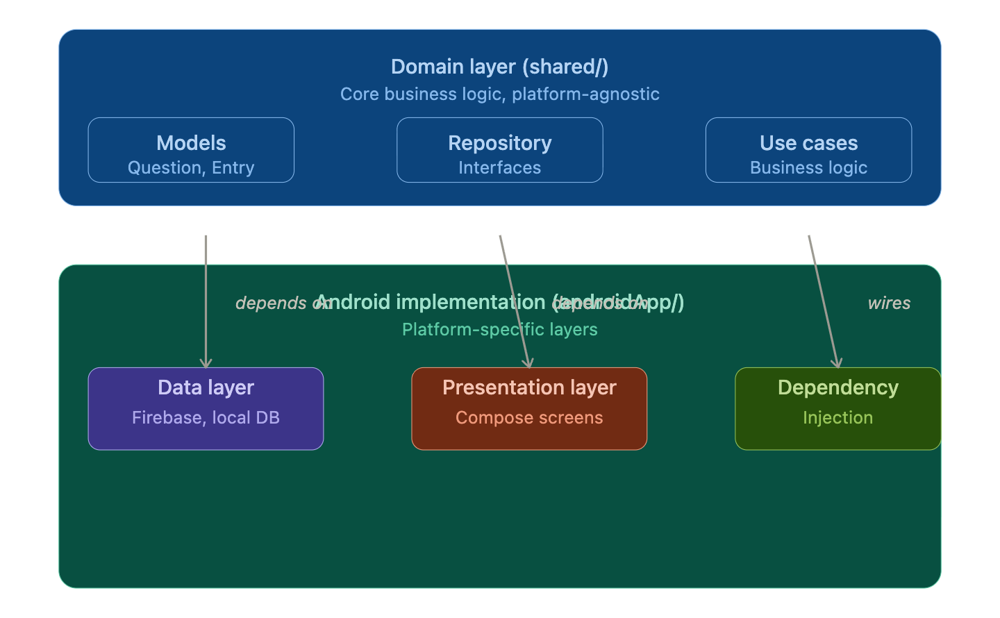

# Recovery Logger

*Work in progress*
Post-surgery recovery tracking made simple. Log daily symptoms, track trends, and share outcomes with your healthcare provider.

## Features

- **Daily Recovery Check-ins**: Answer 8 symptom-focused questions about your recovery (heartburn, swallowing, bloating, diet, etc.)
- **Structured Data**: Responses stored securely in the cloud, ready to export and share with your doctor
- **Offline-First**: Works without internet; syncs when connected
- **Cross-Platform**: Native Android and iOS apps with shared business logic

## Technology Stack

Phase 1 targets Android with:
- Post-fundoplication recovery tracking
- Firebase cloud storage
- Daily questionnaire logging
- Secure user authentication

iOS and multi-intervention support coming in Phase 2+.

## Architecture

- **Kotlin Multiplatform Mobile (KMP)**: Shared domain logic, Android-focused implementation
- **Jetpack Compose**: Modern Android UI
- **Firebase Auth & Firestore**: User authentication and cloud data sync
- **Clean Architecture**: Domain → Presentation → Data layers with repository pattern
- **Hilt**: Dependency injection

